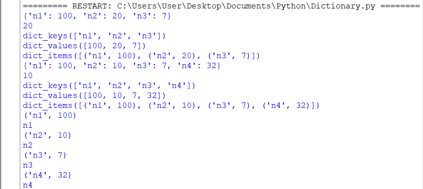
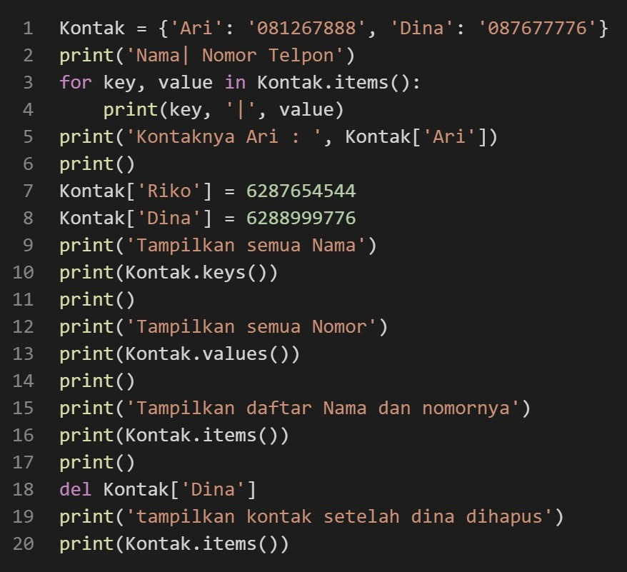
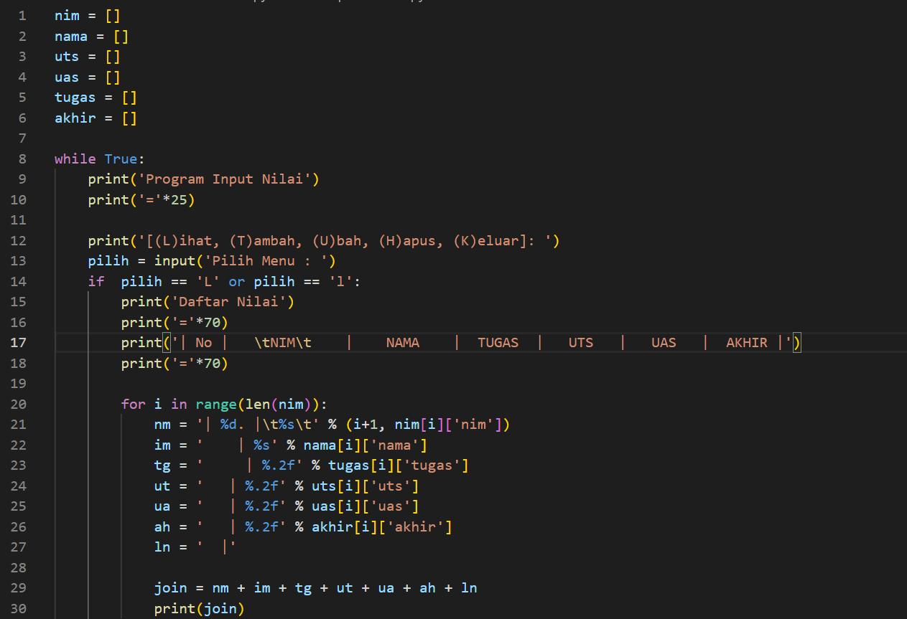
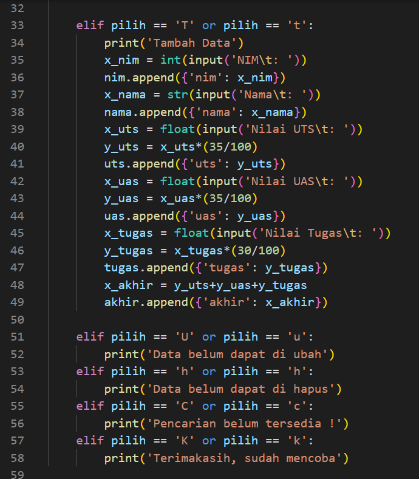
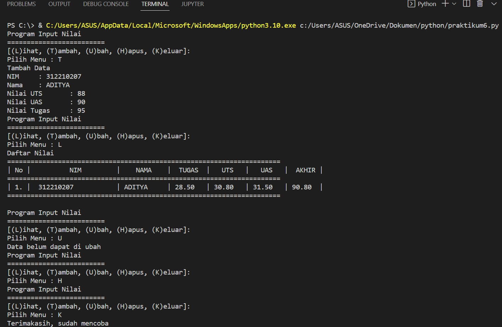

# PRAKTIKUM 6 ADITYA PUTRA WIJAYA

## DICTIONARY
#### - MEMBUAT DICTIONARY
```
a = {} # empty dict
a = ['n1': 100, 'n2': 20, 'n3': 7] # dict with key:value
```
#### - MENGAKSES DICTIONARY
```
print(a['n2']) # print element with key 'n2'
print(a.keys()) # print all key from dict
print(a.values()) # print all value form dict
print(a.items()) # print list of tuple(key, value) form dict
```
#### - MENGUBAH ELEMEN DICTIONARY
```
a['n2'] = 10 # change the item for key 'n2
```
#### - MENAMBAHKAN ELEMEN DICTIONARY
```
a['n4'] # add item with key 'n4'
```
#### - LOOP DICTIONARY
```
for item in a.items():
print(item) # print tuple (key, value)
print(item[0]) # print key item
```
#### - HASIL SETELAH DI RUN




# LATIHAN 1
### MEMBUAT DICTIONARY DAFTAR KONTAK
- Nama sebagai Key dan Nomor sebagai Value
- Tampilkan kontaknya Ari
- Tambah kontak baru dengan nama Riko, nomor 087654544
- Ubah kontak Dina dengan nomor baru 088999776
- Tampilkan semua Nama
- Tampilkan semua Nomor
- Tampilkan daftar Nama dan nomornya
- Hapus kontak Dina.

### CONTOHNYA


### HASIL SETELAH DI RUN


# TUGAS PRAKTIKUM 6
### DAFTAR NILAI MAHASISWA MENGGUNAKAN DICTIONARY
- Pertama kita membuat sebuah dictionary kosong yang nantinya akan diinputkan data ketika program dijalankan.
```
Data = {}
```
- Lalu kita membuat kondisi perulangan dan sebuah keterangan untuk pilihan menu yang akan menjalankan program.
```
while True:
    print('Program Input Nilai')
    print('='*25)

    print('[(L)ihat, (T)ambah, (U)bah, (H)apus, (K)eluar]: ')
```
- Membuat syntax untuk menambahkan data.
```
elif pilih == 'T' or pilih == 't':
        print('Tambah Data')
        x_nim = int(input('NIM\t: '))
        nim.append({'nim': x_nim})
        x_nama = str(input('Nama\t: '))
        nama.append({'nama': x_nama})
        x_uts = float(input('Nilai UTS\t: '))
        y_uts = x_uts*(35/100)
        uts.append({'uts': y_uts})
        x_uas = float(input('Nilai UAS\t: '))
        y_uas = x_uas*(35/100)
        uas.append({'uas': y_uas})
        x_tugas = float(input('Nilai Tugas\t: '))
        y_tugas = x_tugas*(30/100)
        tugas.append({'tugas': y_tugas})
        x_akhir = y_uts+y_uas+y_tugas
        akhir.append({'akhir': x_akhir})
 ```
- Disini apabila kita menginputkan 'T' maka kita akan diminta untuk menginputkan beberapa data. Data yang kita inputkan akan masuk ke dictionary 'Data' yang telah dibuat tadi dengan data 'nama' sebagai keys dan sisanya sebagai values.
- Membuat syntax untuk mengubah data.
```
elif pilih == 'U' or pilih == 'u':
        print('Data belum dapat di ubah')
```
- Apabila kita menginput 'U' maka akan ada keterangan untuk mengubah data dan kita akan diminta untuk menginputkan nama yang mau diubah datanya, apabila nama tidak ada maka outputnya "Nama {} tidak ditemukan". Dimana {} adalah nama/data yang mau kita ubah.
- Membuat syntax untuk menghapus data.
```
elif pilih == 'h' or pilih == 'h':
        print('Data belum dapat di hapus')
```
- Apabila kita menginput 'H' maka kita akan diminta menginput nama yang akan dihapus. Jika nama ada di dalam dictionary, maka system akan menghapus keys/nama tersebut beserta valuesnya pada statement del Data[nama].
- Membuat syntax untuk mencari data.
```
elif pilih == 'C' or pilih == 'c':
        print('Pencarian belum tersedia !')
```
- Apabila kita menginputkan 'C' maka kita akan diminta untuk memasukkan nama yang akan dicari. Apabila nama yang dicari ada di dalam dictionary maka outputnya akan menampilkan data dari nama tersebut.
- Membuat syntax untuk melihat atau menampilkan data.
```
if  pilih == 'L' or pilih == 'l':
        print('Daftar Nilai')
        print('='*70)
        print('| No |   \tNIM\t    |    NAMA    |  TUGAS  |   UTS   |   UAS   |  AKHIR |')
        print('='*70)

        for i in range(len(nim)):
            nm = '| %d. |\t%s\t' % (i+1, nim[i]['nim'])
            im = '    | %s' % nama[i]['nama']
            tg = '     | %.2f' % tugas[i]['tugas']
            ut = '   | %.2f' % uts[i]['uts']
            ua = '   | %.2f' % uas[i]['uas']
            ah = '   | %.2f' % akhir[i]['akhir']
            ln = '  |'

            join = nm + im + tg + ut + ua + ah + ln
            print(join)
        print('='*70, '\n')
```
- Apabila kita menginput 'L' maka sistem akan menampilkan data - data yang sudah kita masukkan. Jika kita belum memasukkan data maka outputnya menjadi "DATA TIDAK DITEMUKAN".
- Membuat syntax untuk menghentikan perulangan.
```
elif pilih == 'K' or pilih == 'k':
        print('Terimakasih, sudah mencobanya')
```
- Apabila kita menginput 'k' maka program akan langsung berhenti.
- Membuat syntax untuk apabila memilih pilihan yang tidak ada di menu.
```
else:
        print("Pilih menu yang tersedia")
```
- Jika kita menginputkan selain yang ada pada menu (T, U, H, C, L, K) maka kita akan diminta untuk memilih menu yang tersedia.

### CONTOH NYA



### HASIL SETELAH DI RUN



