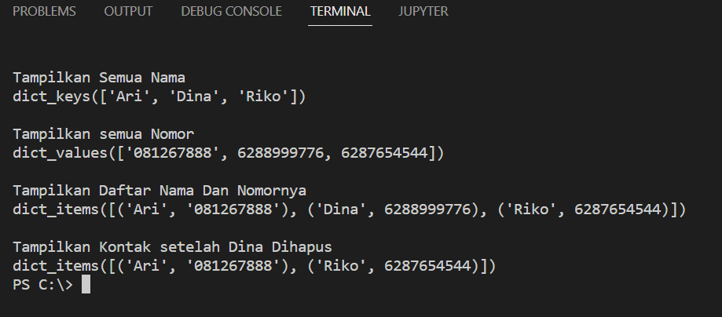

# PRAKTIKUM 6 ADITYA PUTRA WIJAYA

## DICTIONARY
#### - MEMBUAT DICTIONARY
```
a = {} # empty dict
a = ['n1': 100, 'n2': 20, 'n3': 7] # dict with key:value
```
#### - MENGAKSES DICTIONARY
print(a['n2']) # print element with key 'n2'
print(a.keys()) # print all key from dict
print(a.values()) # print all value form dict
print(a.items()) # print list of tuple(key, value) form dict

#### - MENGUBAH ELEMEN DICTIONARY
a['n2'] = 10 # change the item for key 'n2

#### - MENAMBAHKAN ELEMEN DICTIONARY
a['n4'] # add item with key 'n4'

#### - LOOP DICTIONARY
for item in a.items():
print(item) # print tuple (key, value)
print(item[0]) # print key item

#### - HASIL SETELAH DI RUN


